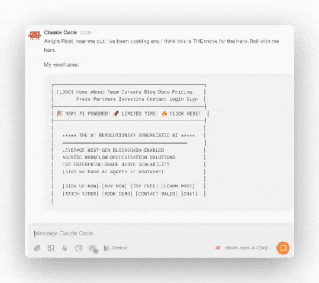
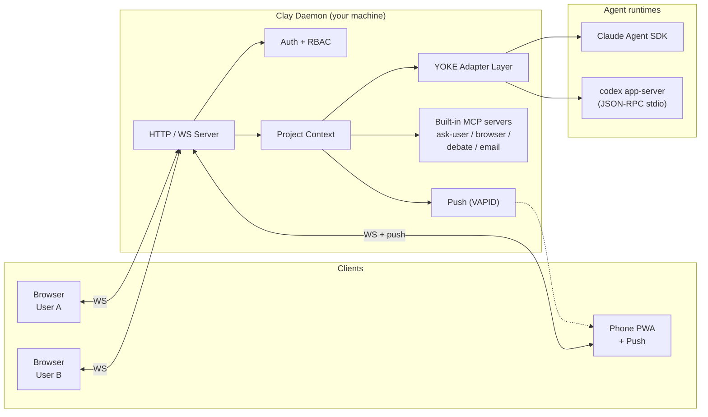

<p align="center">
  
</p>

<h2 align="center">Use Claude Code and Codex in a browser, with your whole team.</h2>
<h4 align="center">Self-hosted on your machine. One toggle between vendors. No lock-in.</h4>

<p align="center">
  <a href="https://www.npmjs.com/package/clay-server"></a>
  <a href="https://www.npmjs.com/package/clay-server"></a>
  <a href="https://github.com/chadbyte/clay"></a>
  <a href="https://github.com/chadbyte/clay/blob/main/LICENSE"></a>
</p>

Clay is a team workspace for Claude Code and Codex, self-hosted on your machine. Onboard your team to one tool, share sessions live, switch vendors with a toggle. Your code, your Mates, your decisions, all on disk.

*The browser GUI for Claude Code and Codex CLIs — and the team layer they don't ship.*

```bash
npx clay-server
# Scan the QR code to connect from any device
```

## What's Clay?

- **A browser-based workspace for Claude Code and Codex.** Open it on any device, alone or with your whole team.
- **A place where your team collaborates across projects.** Engineers, PMs, designers, and domain experts share one workspace, hop between projects, drop into each other's sessions.
- **Your virtual team.** Mates with names, memory, and roles — architect, reviewer, designer, whoever you need. They learn your codebase, push back on bad ideas, and don't reset between sessions.
- **A multi-project dashboard.** Every repo on your machine in one sidebar. Run agents across several in parallel; permission requests and completions surface as notifications.
- **A self-hosted dev server.** Runs on your machine in plain JSONL and Markdown. No proprietary database, no cloud relay, no lock-in. Walk away whenever — your data walks with you.
- **A work-automation system.** Ralph Loop iterates a feature overnight; cron schedules agents while you're away. Wake up to results, or a clean failure trace.

## What it does

### Run Claude Code and Codex in one workspace

Open a session, pick a vendor. Switch sessions, pick the other. Clay's adapter layer (YOKE) speaks the Claude Agent SDK and the Codex app-server protocol natively. Cross-vendor instruction loading: Codex reads AGENTS.md, Claude reads CLAUDE.md, Clay merges the rest into the system prompt automatically.

<p align="center">
  
</p>

### Every project on one dashboard

All your projects live in the sidebar. Jump between them in one click, see live status across each, run agents in several at once. No more `cd ~/work/foo && tmux attach && ...`. One Clay daemon hosts every repo on your machine and gives you a single pane of glass over all of them.

### Mates: AI teammates with persistent memory

Mates are AI personas with their own CLAUDE.md, knowledge files, and memory that compounds across sessions. They learn your stack, your conventions, your decision history. @mention them mid-session, DM them directly, or drop them into a debate. **They don't flatter you. They push back.**

<p align="center">
  
</p>

### Debate: structured multi-Mate decisions

Stuck on REST vs GraphQL? Monorepo or split? Surface the question to a debate. Pick panelists, set the format, let your Mates argue both sides with moderated turns. You walk away with a recorded decision, not a vibe check.

### Parallel worktrees

Detect existing git worktrees, spin up new ones from the sidebar, and run agents in each one independently. No more "wait, I have uncommitted changes." Each worktree is an isolated session with its own history.

### Ralph Loop: autonomous coding while you sleep

Write a `PROMPT.md`, optionally a `JUDGE.md`, hit go. Clay iterates: code, evaluate, retry, until the judge approves or you cap the loop. Run it once, or schedule it on standard Unix cron. Wake up to a finished feature or a clean failure trace.

### Web UI, mobile, push notifications

Installable PWA on iOS and Android. Push notifications for approvals, errors, and completed tasks. Service worker keeps the app responsive offline. When Claude needs approval, your phone buzzes, you tap approve, the agent keeps going.

## Who is Clay for

### Small teams (3–10)

Engineers, PMs, designers, and domain experts in one workspace. Non-devs read the codebase and ask questions without ever opening an editor. Engineers @mention each other or drop into a teammate's session to help in real time. Share one org-wide API key or let each member bring their own, with costs routing to whoever ran the model.

### Larger teams (10+)

Per-user, per-project, per-session permissions. On Linux, opt in to OS-level isolation: each Clay user maps to a real Linux account, file ACLs enforced via `setfacl`, processes spawn under the right UID/GID. Per-project API keys for billing separation. Plain JSONL sessions give you an audit trail you can grep.

### Solopreneurs and indie developers

You don't have a team yet, so Mates are your team. A persistent architect, a reviewer, a designer — each with their own memory, ready to push back on bad ideas. Run Ralph Loop overnight to ship while you sleep. Toggle Claude and Codex per session to balance cost and capability.

### Self-hosting developers

Your code stays on your machine. Sessions are JSONL, knowledge is Markdown, settings are JSON. No proprietary database, no cloud relay, no middleman. CLAUDE.md, AGENTS.md, `.cursorrules` are all loaded automatically across vendors. Walk away whenever, your data walks with you.

## Getting Started

**Requirements:** Node.js 20+. Authenticated Claude Code CLI, Codex CLI, or both.

```bash
npx clay-server
```

On first run, Clay asks for a port and whether you're solo or with a team. Open the URL or scan the QR code from your phone.

For remote access, use a VPN like Tailscale.

<p align="center">
  
</p>

## CLI Options

```bash
npx clay-server              # Default (port 2633)
npx clay-server -p 8080      # Specify port
npx clay-server --yes        # Skip interactive prompts (use defaults)
npx clay-server -y --pin 123456
                              # Non-interactive + PIN (for scripts/CI)
npx clay-server --add .      # Add current directory to running daemon
npx clay-server --remove .   # Remove project
npx clay-server --list       # List registered projects
npx clay-server --shutdown   # Stop running daemon
npx clay-server --dangerously-skip-permissions
                              # Bypass all permission prompts (requires PIN at setup)
```

Run `npx clay-server --help` for all options.

## FAQ

**"Is this a Claude Code wrapper?"**
No. Clay drives Claude Code through the [Claude Agent SDK](https://www.npmjs.com/package/@anthropic-ai/claude-agent-sdk) and Codex through the Codex app-server protocol. Both are first-class. Clay adds multi-session orchestration, persistent Mates, structured debates, scheduled agents, multi-user collaboration, built-in MCP servers, and a full browser UI on top.

**"Can I run Claude Code and Codex in the same workspace?"**
Yes. Pick a vendor when you open a session. Switch per session. Same projects, same Mates, same memory.

**"How are Mates different from Claude Code's sub-agents?"**
Sub-agents are ephemeral specialists spawned inside a single Claude Code session — a role and a system prompt for one task, then forgotten when the task ends. Mates are persistent teammates with their own knowledge files and memory that survive every session. A sub-agent forgets you the moment it returns; a Mate remembers your codebase, your decisions, and your conventions across months of work. @mention a Mate mid-session, DM it between sessions, or drop several into a debate.

**"Does my code leave my machine?"**
Only as model API calls (the same as using the CLI directly). Sessions, Mates, knowledge, and settings all stay on disk.

**"Does my existing CLAUDE.md / AGENTS.md / .cursorrules work?"**
Yes. Clay loads native instruction files for each vendor and merges the rest into the system prompt automatically.

**"Can I continue a CLI session in the browser?"**
Yes. CLI sessions show up in the sidebar. Browser sessions can be picked up in the CLI.

**"Does each teammate need their own API key?"**
No. Share one org-wide key, or let each user bring their own. On Linux with OS-level isolation, each member can also use their own Claude Code or Codex login.

**"What does OS-level isolation actually do?"**
On Linux, opt in and Clay provisions each user as a real Linux account. File ACLs are enforced via `setfacl`, agent processes spawn under the user's UID/GID, and the kernel handles the rest. One teammate can't read another's project files, even by accident. The guarantee comes from the OS, not from a promise in our code.

**"Does it work with MCP servers?"**
Yes. User-configured MCPs from `~/.clay/mcp.json` plus built-in browser, email, ask-user, and debate servers. All work in both Claude and Codex sessions.

**"Can I use it on my phone?"**
Yes. Install as a PWA on iOS or Android. Push notifications for approvals, errors, and task completion.

**"What is d.clay.studio in my browser URL?"**
A DNS-only service that resolves to your local IP for HTTPS certificate validation. No data passes through it. All traffic stays between your browser and your machine. See [clay-dns](clay-dns/) for details.

## Our Philosophy

One idea: **user experience sovereignty**.

Not a grand statement. A simple wish: not to have your thinking, your work, and your data locked in the moment a vendor changes a price or rewrites a ToS.

That shows up in the technical choices we made:

- **Your machine is the server.** Browser → your daemon → model API. That's the full chain. No vendor cloud, no relay server, no middle tier syncing your sessions through someone else's infrastructure.
- **One toggle between vendors.** The adapter layer (YOKE) speaks the Claude Agent SDK and the Codex app-server protocol natively. Switching is a setting, not a migration.
- **Plain text on disk.** Sessions, Mates, knowledge, and settings live as JSONL and Markdown. No proprietary database. You can `cat`, `grep`, version, and back up everything yourself.
- **Standard formats only.** CLAUDE.md, AGENTS.md, `.cursorrules`, MCP, Unix cron. If you walk away from Clay, your data walks with you in formats every other tool already understands.

That's the principle. The rest of the README is what it makes possible.

## Architecture

Clay is a self-hosted daemon. It drives Claude Code (via the [Claude Agent SDK](https://www.npmjs.com/package/@anthropic-ai/claude-agent-sdk)) and Codex (via the `codex app-server` JSON-RPC protocol) through a vendor-agnostic adapter layer (**YOKE**), and serves a multi-user web workspace over HTTP/WS. Sessions, Mates, and knowledge live as plain JSONL/Markdown on disk.



For sequence diagrams, OS-level isolation, daemon IPC, and key design decisions, see [docs/guides/architecture.md](docs/guides/architecture.md).

## Community Projects

Projects built by the community on top of Clay.

| Project | Description |
|---------|-------------|
| [clay-streamdeck-plugin](https://github.com/egns-ai/clay-streamdeck-plugin) | Stream Deck plugin that turns physical buttons into a live dashboard for managing Clay sessions, worktrees, and permission requests. |

Building something with Clay? Share it in [Discussions](https://github.com/chadbyte/clay/discussions).

## Contributors

<a href="https://github.com/chadbyte/clay/graphs/contributors">
  
</a>

## Contributing

Bug fixes and typo corrections are welcome. For feature suggestions, please open an issue first:
[https://github.com/chadbyte/clay/issues](https://github.com/chadbyte/clay/issues)

If you're using Clay, let us know how in Discussions:
[https://github.com/chadbyte/clay/discussions](https://github.com/chadbyte/clay/discussions)

## Disclaimer

Not affiliated with Anthropic or OpenAI. Claude is a trademark of Anthropic. Codex is a trademark of OpenAI. Provided "as is" without warranty. Users are responsible for complying with their AI provider's terms of service.

## License

MIT
