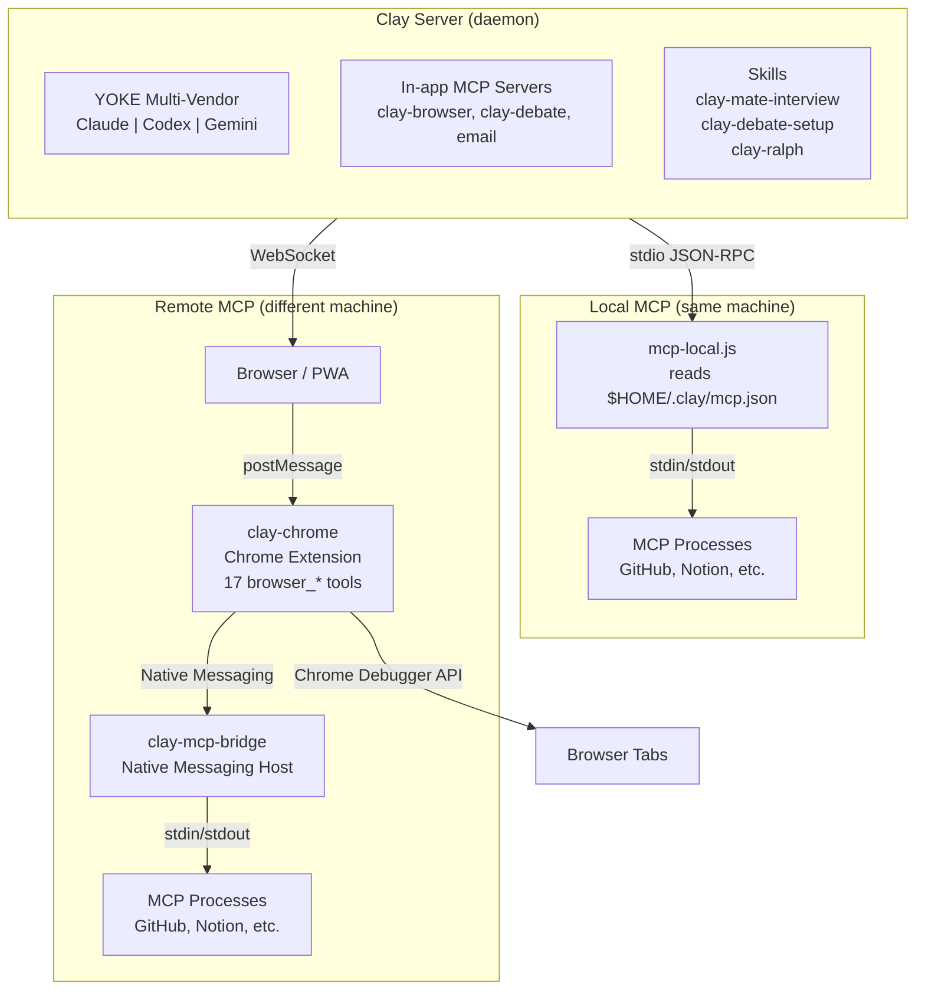
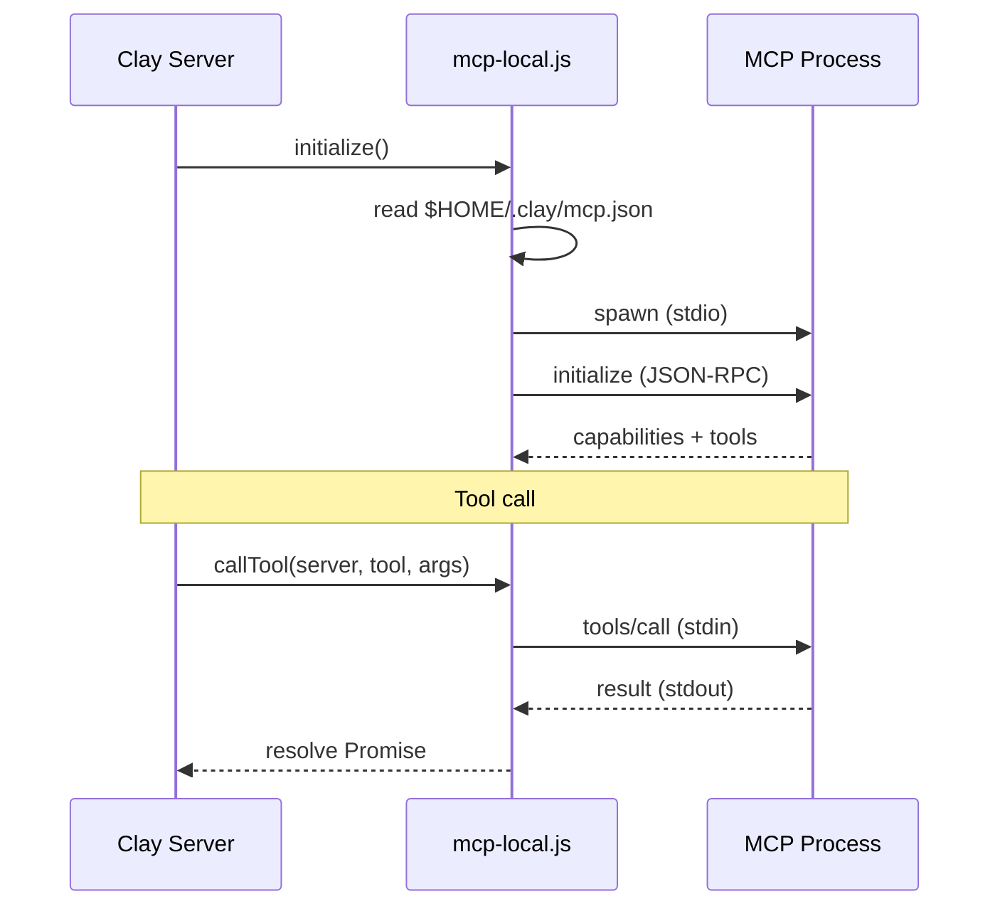
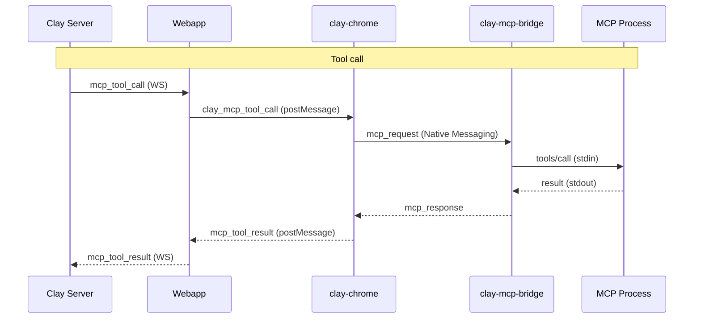
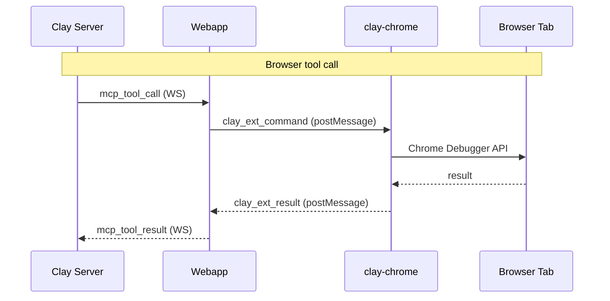

# Clay Ecosystem

> All repositories, their roles, and how they connect. Read this before working on cross-repo features.

---

## Project Registry

| Repo | Path | Type | Description |
|------|------|------|-------------|
| **clay** | `.` (this repo) | Core | Main server, daemon, webapp, SDK bridge, YOKE multi-vendor adapter |
| **clay-chrome** | `../../../clay-chrome` | Extension | Chrome/Arc extension for browser automation and MCP relay |
| **clay-mcp-bridge** | `../../../clay-mcp-bridge` | NPM Package | Native Messaging Host, spawns local MCP servers for remote Clay instances |
| **clay-mate-interview** | `../../../clay-mate-interview` | Skill | Deep interview skill for shaping a Mate's identity (generates CLAUDE.md) |
| **clay-debate-setup** | `../../../clay-debate-setup` | Skill | Prepares structured debates between Mates (topic, format, roles, brief) |
| **clay-ralph** | `../../../clay-ralph` | Skill | Designs autonomous coding loop prompts (PROMPT.md + JUDGE.md for Ralph Loop) |

---

## Architecture

---

## Connection Paths

### Local user (same machine as Clay server)

No extension or bridge needed. `mcp-local.js` reads `$HOME/.clay/mcp.json` directly.

### Remote user (browser on different machine)

Requires clay-chrome extension + clay-mcp-bridge installed on user's machine.

### Browser automation (all users)

Extension provides browser_* tools via Chrome Debugger API. No bridge needed.

---

## Vendor Support (YOKE)

YOKE (Yoke Overrides Known Engines) is the multi-vendor adapter layer in `lib/yoke/`.

| Vendor | Adapter | Auth Check | MCP Support |
|--------|---------|------------|-------------|
| Claude | `yoke/adapters/claude.js` | `claude auth status` | Full (in-process SDK MCP servers) |
| Codex | `yoke/adapters/codex.js` | `codex login status` | Not yet (needs stdio MCP bridge, see CODEX-INTEGRATION.md) |
| Gemini | `yoke/adapters/gemini.js` | Planned | Planned |

### Codex MCP gap
Codex runs as a child process (`codex exec --json`). It cannot access Clay's in-process MCP servers directly. The planned solution is a stdio MCP bridge that Codex connects to natively via `CodexOptions.config.mcp_servers`. See `docs/roadmaps/in-progress/yoke/codex/CODEX-INTEGRATION.md`.

---

## Skills

Skills are installable packages that run within Clay sessions. They are NOT separate servers.

| Skill | Trigger | What it does |
|-------|---------|--------------|
| clay-mate-interview | New Mate creation, `/clay-mate-interview` | Conducts identity interview, generates Mate's CLAUDE.md |
| clay-debate-setup | Debate button, `/clay-debate-setup` | Reads team CLAUDE.md + digests, prepares debate brief |
| clay-ralph | `/clay-ralph` | Explores codebase, interviews user, writes PROMPT.md + JUDGE.md |

Skills are discovered from the user's skills directory and merged into slash commands during SDK warmup.

---

## Key Config Files

| File | Purpose |
|------|---------|
| `$HOME/.clay/mcp.json` | MCP server definitions (command, args, env) + include list |
| `$HOME/.clay/daemon.json` | Project list, per-project settings (enabledMcpServers, etc.) |
| `$HOME/.codex/config.toml` | Codex CLI configuration (plugins, project trust levels) |
| `$HOME/.claude/settings.json` | Claude Code settings |

---

## Cross-repo References

When modifying MCP message flow, these files must stay in sync:

| Message | clay (server) | clay-chrome (extension) | clay-mcp-bridge (host) |
|---------|---------------|------------------------|----------------------|
| Tool call | `project-mcp.js` createToolHandler | `background.js` mcpRelayToolCall | `host.js` relayToolCall |
| Tool result | `project-mcp.js` handleToolResult | `background.js` mcpHandleNativeMessage | `host.js` handleMcpResponse |
| Server list | `project-mcp.js` handleServersAvailable | `background.js` broadcastMcpServers | `host.js` getServers |

See `docs/guides/MCP-IMPLEMENTATION.md` for detailed message flow diagrams.
